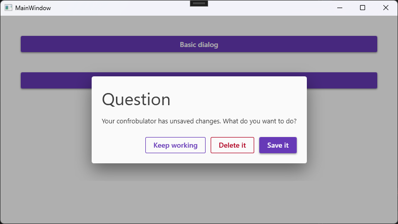

# MaterialDesign.DialogPlus



MaterialDesign.DialogPlus is a small package to make working with dialogs a bit easier in the excellent [MaterialDesignInXaml](https://github.com/MaterialDesignInXAML/MaterialDesignInXamlToolkit). It consists of only a few small files, has no dependencies (besides MaterialDesignInXaml!) and supports .NET 7.0 all the way back to .NET Framework 4.6.2.

MaterialDesignInXaml has great support for dialogs, but it's not clear how to use multiple dialogs with its `DialogHost`. This package provides the following components to make your dialog experience more fun:

 - `IHasDialogResult<T>`: an interface for a cancelable dialog with genericised result
 - `ShowDialogForResultAsync<T>`: a wrapper method to show a dialog and wait for its response
 - `Dialog`: a generic dialog imlpementation with title, message and configurable buttons which should suit 99% of your dialog use-cases.
 - `ButtonDef`: A simple model for dialog buttons. Includes a label, a "connotation" (Positive, Negative, or Neutral) which determines how the button is drawn, and a couple properties to make the button activate on [Enter] or [Esc].

### Basic dialog

Here's the code for the above screenshot:
```
ButtonDef result = await this.ShowDialogForResultAsync( new Dialogs.Dialog( "Question",
    "Your confrobulator has unsaved changes. What do you want to do?",
    ButtonDef.Neutral( "Keep working", isCancel: true ),
    ButtonDef.Negative( "Delete it" ),
    ButtonDef.Positive( "Save it", isDefault: true ) ) );
```

Our example dialog in this case implements `IHasDialog<ButtonDef>`, meaning the result will be one of the three buttons you passed in. But your dialog can return anything you like.

### Custom dialog

1. Create a `UserControl`. Design the dialog XAML however you like.
2. Make your dialog implement `IHasDialogResult<T>` with the desired result type. For example, if your dialog is a text input, you might implement `IHasDialogResult<string>`.
3. To close your dialog, call `Result.Set` with the dialog result (for the text input example, this might be the user-input text, or `null` if the user canceled the dialog).

Check out the [main file](MaterialDesign.DialogPlus.Examples/MainWindow.xaml.cs) of the example project for the following examples:

1. The basic dialog shown in the first screenshot.
2. Canceling a dialog with a CancelToken.
3. A custom input dialog with multiple inputs.
